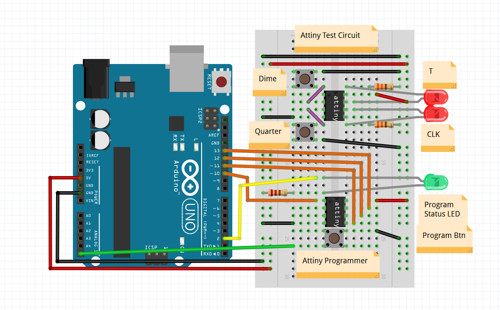
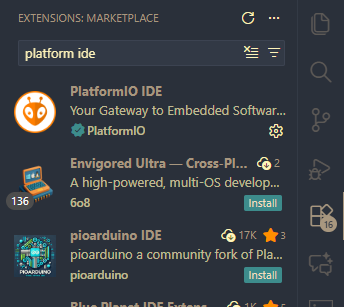
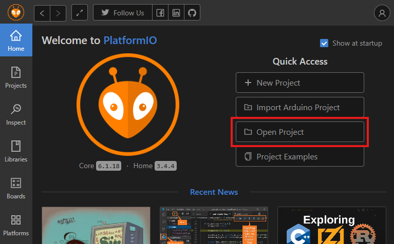
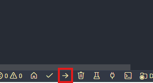

# ECE120 Lab 8 Attiny Programmer

This repository stores the code for ECE120's 8 Attiny13A and a Arduino Uno programmer to program each Attiny13A if any are broken.

## How to use the programmer

Place the Attiny13A in the Programmer circuit (bottom Attiny as shown in [1. Build the Following Circuit](#1-build-the-following-circuit)).

Press the **Program Btn** Push Button and wait a few seconds.

If the **Program Status LED** flashes, then the program was correctly flashed! Test the attiny in the tester circuit / [standalone circuit](#standalone-attiny13a-circuit) if desired.

If the **Program Status LED** does not flash, then try restarting the Arduino Uno. If that doesn't fix it, the Attiny is likely too broken to be flashes. (Feel free to check the exact serial logs for debugging)

See here for a video example of how to use the programmer!
https://github.com/user-attachments/assets/2ebe2cf9-ea08-4a3d-a909-2470eb8b089c

## Programmer Installation Instruction

Instructions on how to Program Attiny13A's for ECE 120 Lab 8!

Required Parts...

- Arduino Uno (the programmer)
- Attiny13A (the chip you are programming)
- Push Buttons
- LEDs

### 1. Build the following Circuit

Note you only need one attiny. Move it from the bottom programmer circuit to the top testing circuit to ensure the program was correctly flashed.

### 2. Install Platform IO IDE on VSCode

Installation Docs:
https://docs.platformio.org/en/stable/integration/ide/vscode.html#id1

Or simply just earch "Platform IDE" in the VSCode extensions tab.

> Note: VSCode is not required, but it is the only IDE that has been tested by the developer.

### 3. Program the Arduino Uno

Open this project in VSCode. Then open Platform IO IDE in VSCode and use its open button to open the project in the Platform IO "IDE". (Note IDE is in quotes because you will still be in VSCode. Its called an IDE because now you will have access to custom build and upload buttons at the bottom of the screen)

Now connect the Computer to the Arduino Uno via USB and press the Upload Button at the bottom of the screen <code>-></code>. (This will Build and Upload the Arduino Uno Programmer Code to the Arduino Uno so it can flash the Attiny13As with the lab 8 program)

See here for all toolbar button descriptions.
https://docs.platformio.org/en/stable/integration/ide/vscode.html#platformio-toolbar

## Standalone Attiny13A Circuit

Students should connect the Attiny13A as below for lab 8.

